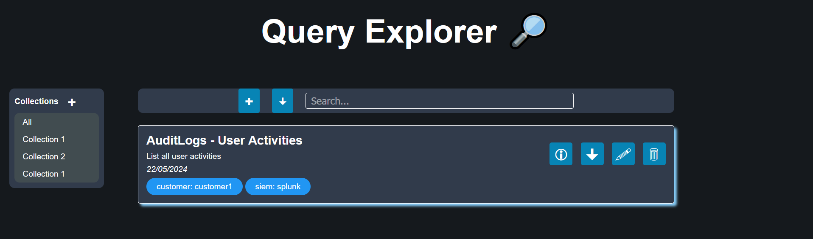

# Query Explorer

This project is a draft of a web application using Flask for the storage and management of queries from different solutions (such as SPL from Splunk and KQL from Sentinel).

The design is inspired by the web application called **KQL Search** by **Ugur Koc**.

- https://github.com/ugurkocde/KQL-Search
- https://www.kqlsearch.com/

